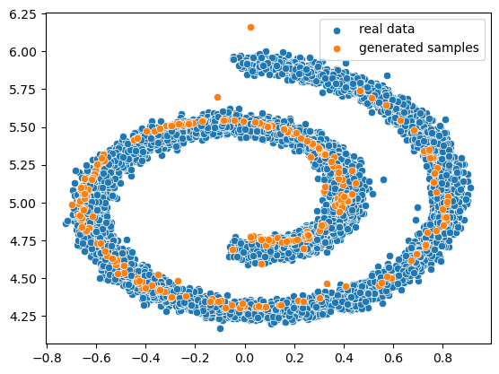
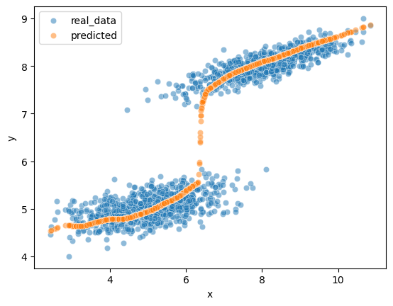
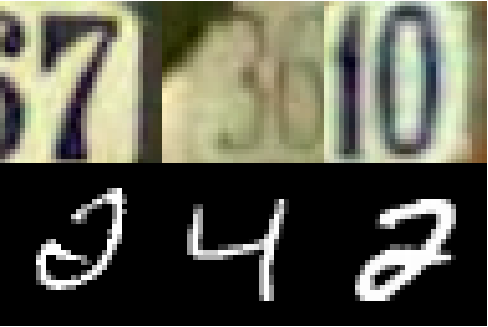
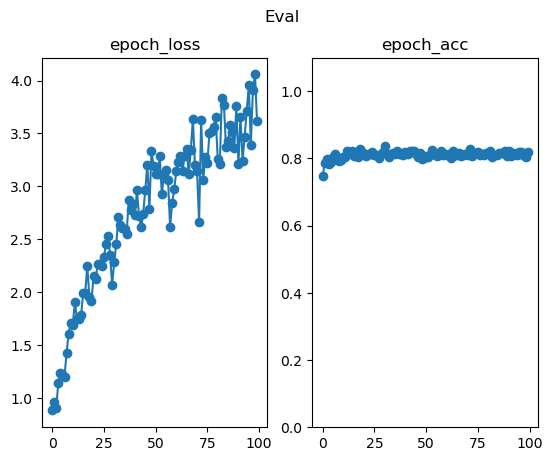

# GANs and Adversarial Domain Adaptation

Author: Sebastian Bujwid <bujwid@kth.se>

This practical covers:
- [Part 1: Training a GAN on 2-D toy datasets](./gan_part1.ipynb)
- [Part 2: Supervised regression with an extra GAN loss](./gan_part2_discriminator_loss_for_regression.ipynb)
- [Part 3: Adversarial domain adaptation (SVHN → MNIST)](./gan_part3_dann_svhn_to_mnist.ipynb)

## Objectives <small>(_what's in it for me?!_)</small>

**1. Better knowledge of GANs**

- Know how to implement a GAN

<small>

Swiss roll model from Part 1
</small>

- Hopefully, better intuition on:
    - GAN training dynamics,
    - What problems GANs can be useful for and what problem they would likely not solve
    - The first two parts of the practical use toy datasets which makes it much easier to see how the models are training and what did they learn

**2. Practical (technical / implementation) skills:**

- From the technical aspect, GAN training is different from many typical supervised training setups as it consists of two seperate networks trained to compete against each other. That makes the implementation slightly more ~~challenging~~ interesting!

- Part 3 uses a custom operation, _gradient reversal layer_, which is a simple operation that reverses the gradients (and multiplies by a constant). Typically, when using deep learning frameworks you don't have to think how gradients are computed, but here, you will have to manually implement this operation which will be great opportunity to remind yourself how automatic differentation, backpropagation, and chain-rule work!

**3. The concept of GAN training, beyond generating nice samples**

GANs are famous for generating impressive images, etc. but this practical demonstrates that the concept of GAN training is a more general idea and can be applied to very different setups!
This practical covers only two selected setups:

- Part 1: Using an extra GAN objective with supervised MSE regression: how adding a disciminator changes the properties of the solution

<table><tr>
<td style="width: 50%" align="center">
    
    

    <small>
        <strong>MSE loss:</strong> 
        the region in the center (connecting the two regions of data) might minimize MSE but the data in that regions is very unlikely to occur.
    </small>
    

</td>
<td style="width: 50%" align="center">
    
    

    <small>
        <strong>MSE + GAN loss:</strong> 
        the model learns to (almost) avoid the region in the center where data samples are very unlikely to occur.
    </small>
    

</td>
</tr></table>

- Part 3: Using a (domain) discriminator to make a CNN trained on SVHN digits perform better on MNIST (adversarial domain adaptation setup)

**4. Stay curious and explore!**

Hopefully, this practical will spark your curiosity and make you more eager to explore the area yourself!
The scope and the content of this practical was designed in a way that even if you already have experience with training GANs, you can hopefully still learn something new from doing it!

* How easy is it to train a (standard) GAN on a <a href="#swiss_roll">Swiss roll data</a>? Are the models very sensitive to the hyperparameters? Which of them are more important than others?

<ul>
<li>
How is it possible that the DANN model evaluated on the target data (MNIST) has a high accuracy but also such an insanely high cross-entropy? <small>(The cross-entropy was actually much lower when no domain adaptation was done!)</small>

    
    

    <small>
        Cross-entropy and accuracy of DANN model on MNIST as the model is trained on SVHN
    </small>
    

 
Does it even make sense? (Note that on 10-class classification by random chance one could expect the cross-entropy of 2.30). Why would it happen? Isn't it a "bad" thing?
</li>
</ul>

The only way to find out is to try! Unfortunately, all you can see here is just plots. If you want to investigate the models and experiment with them you'll have to implement the models.

## Other comments

- Luckily (for you), you are provided with a structure that already contains the most boring parts, such as visualization of the training, data loading & processing, most of the training loops.
**All you need to implement is to the most important and interesting parts!**

- If you implement things correctly you should (hopefully) be able to reproduce most of the outputs provided:
    - Some checks are available that you can verify that you have the basic things right. This should let make it less likely to avoid getting stuck on a simple mistake (e.g. missing a minus somewhere, etc.) but those checks do not guarantee correctness!
    - Some parts are expected to perform well straight away, but some parts are more open and you're expected to experiment a bit with them yourself! It's expected to struggle to get some of the parts working well

- The models in the first two parts of the practical are very quick to train! Less time wasted on waiting for long just to realize that something doesn't work! Part 3 takes a little bit more time but is still relatively quick.

- Toy data, used in Part 1 & Part 2, can be much great for building understanding and intuition. Additionally, it allows very quick training. However, keep in mind that more complex data might have challenges that do not exist on toy data.

- The code structure provided in the practical makes things a little bit easier. It covers many small details that it is possible to get wrong (e.g. minor data loading errors that could make the training go wrong, etc.). That hopefully means that you can use your time more efficiently, focusing on the most exciting parts. However, that might be tricky if later on, at some point in the future, you try implementing similar models on novel problems/setup. Then, if things do not work well, it's basically impossible to know for sure whether the model doesn't work  because the problem is too difficult, or because of some slight errors or not getting some tiny details "right."
    - **Therefore, it's recommended (although completely optional!) that after completing all the parts, you think of a relatively similar setup(s) to those used in the practical and try to implement it all from scratch, without even looking back at any code used in the practical!**.
    You could try something that is a little bit more difficult than what was done in the practical but try not to make things too challenging at first, as you risk getting stuck completely. So maybe training a GAN on MNIST digits generation or something like that. Doing every single part yourself, without any help, might be a great exercise to release the importance of small details that you might not have paid much attention to. That might hopefully give you a better picture of how much effort can be necessary to make things work and get a better intuition on how much trying is worth before giving up on some problem :)

## Technical details

- conda environment used: [environment.yml](./environment.yml) (might contain more packages than necessary)
